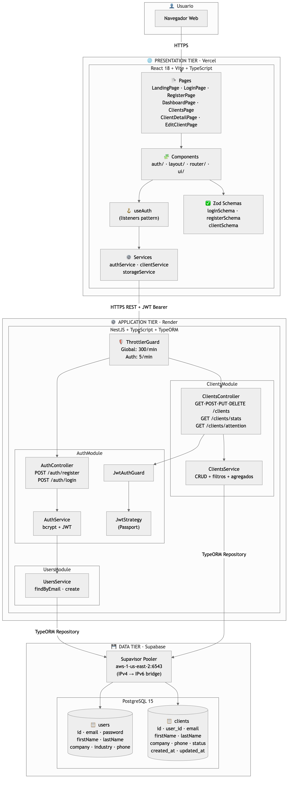
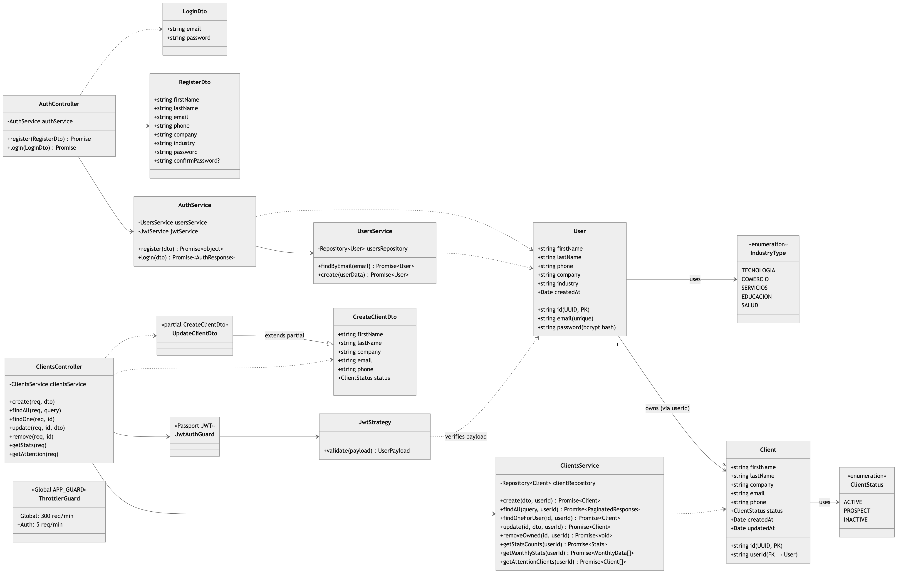

# Arquitectura del Sistema — CRM Cloud MVP

Este documento describe la arquitectura implementada en el proyecto, las decisiones de diseño y los diagramas de soporte (arquitectura general + diagrama de clases del backend).

---

## 1. Patrón arquitectónico implementado

El sistema implementa una **arquitectura de tres capas (3-Tier Architecture)** desplegada como aplicación **cloud-native** con servicios gestionados, combinada con un patrón **Cliente-Servidor REST** y **autenticación stateless basada en JWT**. El backend internamente sigue una **arquitectura por capas (Layered Architecture)** organizada en **módulos** según el estilo recomendado por NestJS.

### 1.1 Las tres capas (3-Tier)

| Capa | Responsabilidad | Tecnología | Plataforma |
|---|---|---|---|
| **Presentation Tier** | Renderizado de UI, validación de formularios en cliente, navegación, gestión de sesión en navegador | React 18 + Vite + Tailwind | **Vercel** (CDN global, despliegue continuo) |
| **Application Tier** | Lógica de negocio, autenticación, autorización, validación de DTOs, orquestación de datos | NestJS + TypeORM | **Render** (contenedor Docker) |
| **Data Tier** | Persistencia, consultas, agregaciones SQL, integridad referencial | PostgreSQL 15 | **Supabase** (PostgreSQL gestionado) |

### 1.2 Arquitectura interna del backend (Layered)

Dentro del Application Tier, el backend está organizado en cuatro capas verticales agrupadas por módulo de dominio:

```
┌─────────────────────────────────────────────────┐
│  Controller    →  HTTP / Routing / DTO binding  │
├─────────────────────────────────────────────────┤
│  Service       →  Lógica de negocio             │
├─────────────────────────────────────────────────┤
│  Repository    →  TypeORM (CRUD + Query Builder)│
├─────────────────────────────────────────────────┤
│  Entity        →  Modelos de dominio (BD)       │
└─────────────────────────────────────────────────┘
```

Módulos del dominio: **AuthModule**, **UsersModule**, **ClientsModule**.

---

## 2. ¿Por qué esta arquitectura?

### 2.1 Separación física de responsabilidades

Cada capa se despliega y escala de forma independiente:

- El **frontend** es estático (HTML/JS/CSS) y vive en un CDN — costo casi cero, latencia mínima global.
- El **backend** es un servicio sin estado que se puede replicar horizontalmente sin coordinación.
- La **base de datos** está totalmente desacoplada — puede crecer en tamaño, escalar verticalmente o migrar sin tocar el resto.

Si mañana el frontend necesita reescribirse en otro framework, el backend no cambia. Si el equipo decide cambiar de PostgreSQL a otro motor compatible, el frontend ni se entera.

### 2.2 Cloud-native con servicios gestionados

Optamos por **plataformas gestionadas** (Vercel, Render, Supabase) en lugar de provisionar servidores propios. Razones:

- **Cero administración de infraestructura** — sin sistemas operativos que parchar, sin nginx que configurar, sin certificados TLS que renovar manualmente.
- **Redespliegue automático** — cualquier `git push` a `main` activa la reconstrucción y publicación en Vercel (frontend) y Render (backend) gracias a la integración nativa de ambas plataformas con GitHub.
- **Capa gratuita** suficiente para un MVP universitario.
- **HTTPS por defecto** en las tres capas, sin configuración adicional.

### 2.3 REST stateless + JWT

Elegimos **REST con JWT** en lugar de sesiones server-side. Razones:

- **Backend sin estado** — cualquier instancia puede atender cualquier petición; escalado trivial.
- **Sin Redis ni session store** — una dependencia menos en la infraestructura.
- **Frontend desacoplado** — el cliente puede ser cualquier consumidor (SPA, móvil futuro, otra integración).
- **Expira en 24h** — válido para el caso de uso, sin necesidad de revocación inmediata.

Trade-off conocido: no podemos invalidar tokens individualmente. Lo aceptamos por el alcance del MVP (documentado en `BUGS_Y_REGRESIONES.md` como deuda técnica para una iteración futura).

### 2.4 Aislamiento multi-tenant a nivel de aplicación

Cada usuario solo accede a sus propios clientes. Esto se implementa en la capa de **Service** filtrando todas las queries por `userId` extraído del JWT (`req.user.id`). El constraint `UNIQUE(email, user_id)` en la tabla `clients` garantiza que dos usuarios pueden tener clientes con el mismo email sin conflicto.

### 2.5 Decisiones técnicas clave derivadas de la arquitectura

| Decisión | Motivación |
|---|---|
| **Supavisor Pooler** (puerto 6543) en lugar de conexión directa a Supabase | El free tier de Supabase usa IPv6 exclusivamente y Render solo enruta IPv4 saliente. El Pooler actúa como bridge IPv4↔IPv6. |
| **`synchronize: false` en producción** | TypeORM no debe alterar el schema en producción. La columna `user_id` se agregó vía `ALTER TABLE` manual. |
| **Rate limiting global + específico en auth** | 300 req/min global para no romper el dashboard (6 calls iniciales), 5/min en `/auth/login` y `/auth/register` para prevenir brute force. |
| **JWT validation sin query a BD** | `JwtStrategy.validate()` retorna el payload directamente; evita una query por cada request autenticado. |
| **`vercel.json` con rewrites** | React Router SPA — todas las rutas deben servir `index.html`; sin esto, recargar `/dashboard` daba 404. |

---

## 3. Diagrama de arquitectura



> Fuente Mermaid editable: [`diagramas/arquitectura.mmd`](diagramas/arquitectura.mmd)

### 3.1 Flujos de comunicación

1. **Usuario → Vercel**: HTTPS al CDN global. Vercel sirve la SPA (HTML inicial + bundle JS) y rewrites de React Router.
2. **Vercel → Render**: el cliente JS hace llamadas REST con `Authorization: Bearer <jwt>`. Atraviesa el `ThrottlerGuard` global.
3. **Render → Supabase**: el backend abre conexiones TCP al Pooler (puerto 6543) sobre TLS. Las queries van a través de TypeORM.

### 3.2 Flujo de autenticación

```
1. Usuario → POST /auth/register
   → AuthController → AuthService → bcrypt.hash() → UsersService.create()
   → respuesta 201

2. Usuario → POST /auth/login
   → AuthService → UsersService.findByEmail()
   → bcrypt.compare()
   → JwtService.sign({ sub: userId, email })
   → respuesta { access_token, user }

3. Frontend almacena el token en localStorage (crm_token, crm_user, crm_timestamp)

4. Cualquier request a /clients/* incluye Authorization: Bearer <token>
   → ThrottlerGuard valida límite
   → JwtAuthGuard extrae el token
   → JwtStrategy.validate() retorna { id, email } sin consultar BD
   → Controller recibe req.user con el payload
   → Service filtra por userId
```

---

## 4. Diagrama de clases (backend)



> Fuente Mermaid editable: [`diagramas/clases.mmd`](diagramas/clases.mmd)

### 4.1 Entidades del dominio

- **`User`**: representa una cuenta empresarial. Email único globalmente. Contraseña almacenada como hash bcrypt (10 rounds). Industria como string (idealmente sería un enum de BD, ver deuda técnica M-4 en `BUGS_Y_REGRESIONES.md`).
- **`Client`**: cliente gestionado por un `User`. Constraint `UNIQUE(email, user_id)` permite que distintos usuarios manejen un mismo email. Status es enum de PostgreSQL (`Activo`, `Prospecto`, `Inactivo`). Tiene `createdAt` y `updatedAt` para soportar la regla de "10 días sin actividad" del panel de atención.

### 4.2 DTOs (Data Transfer Objects)

Capa de validación y transporte entre el HTTP y los servicios. Decorados con `class-validator`:

- `RegisterDto`, `LoginDto` — para el flujo de autenticación
- `CreateClientDto`, `UpdateClientDto` (partial del create) — para el CRUD de clientes

Los DTOs **nunca son entidades de BD** — esto desacopla el contrato API del modelo de persistencia.

### 4.3 Services (lógica de negocio)

- `UsersService`: operaciones puras sobre la tabla `users` (`findByEmail`, `create`).
- `AuthService`: orquesta registro y login. Maneja hashing, comparación de contraseñas, generación de tokens y manejo de errores específicos (conflictos por email duplicado, credenciales inválidas).
- `ClientsService`: CRUD + búsqueda + filtros + paginación + agregaciones (stats por estado, gráfica mensual, clientes que requieren atención). Todas las queries filtran por `userId` para aislamiento multi-usuario.

### 4.4 Controllers (capa HTTP)

- `AuthController`: dos endpoints públicos (`/auth/register`, `/auth/login`).
- `ClientsController`: todos los endpoints protegidos por `JwtAuthGuard`. Recibe `req.user` con el payload JWT y lo pasa a los servicios.

### 4.5 Guards y Strategy (seguridad)

- `JwtStrategy` (Passport): extrae el JWT del header `Authorization`, lo verifica con `JWT_SECRET` y retorna el payload.
- `JwtAuthGuard`: aplicado por controlador. Bloquea peticiones sin token válido con 401.
- `ThrottlerGuard`: registrado globalmente vía `APP_GUARD`. Aplica 300 req/min global y 5 req/min en endpoints de auth (con `@Throttle()`).

---

## 5. Arquitectura del frontend (resumen)

El frontend sigue una **arquitectura por componentes** organizada en capas funcionales:

```
src/
├── pages/        → componentes de ruta (1 archivo = 1 URL)
├── components/   → componentes reutilizables (auth, layout, router, ui)
├── hooks/        → lógica de estado (useAuth con patrón listeners)
├── services/     → cliente HTTP (Axios) y storage (authService, clientService, storageService)
├── schemas/      → validaciones Zod (loginSchema, registerSchema, clientSchema)
├── types/        → contratos TypeScript (auth.ts, client.types.ts)
└── router/       → configuración de React Router con ProtectedRoute y PublicRoute
```

La gestión de estado de sesión NO usa Context API ni Redux. En su lugar, `useAuth` implementa un **patrón de suscriptores** (listener pattern) con una variable a nivel de módulo y una lista de callbacks, lo que evita el árbol de Providers y el re-rendering global.

---

## 6. Resumen

| Aspecto | Decisión |
|---|---|
| **Patrón principal** | 3-Tier Architecture · Cloud-Native |
| **Patrón backend** | Layered Architecture + Module-based (NestJS) |
| **Patrón frontend** | Component-based + Custom Hook (listener pattern) |
| **Comunicación** | REST sobre HTTPS, JSON |
| **Autenticación** | JWT stateless (24h) + bcrypt (10 rounds) |
| **Autorización** | Filtrado por `userId` en cada query (aislamiento multi-tenant a nivel de app) |
| **Persistencia** | PostgreSQL gestionado vía TypeORM + Supabase Pooler |
| **Despliegue** | Redespliegue automático: GitHub → Vercel (frontend) + Render (backend) |
| **Seguridad adicional** | Rate limiting, validación de DTOs (class-validator), HTTPS forzado, CORS configurable |
